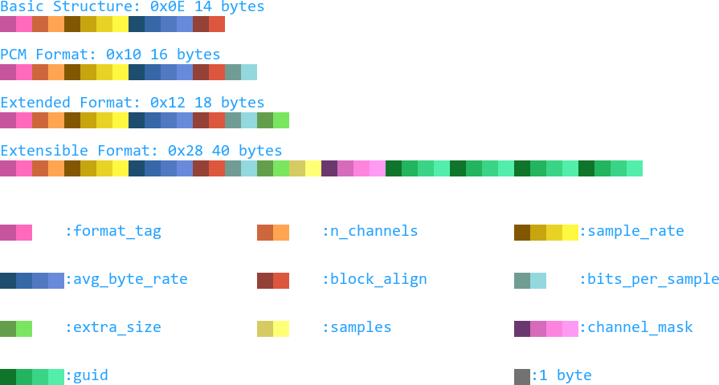
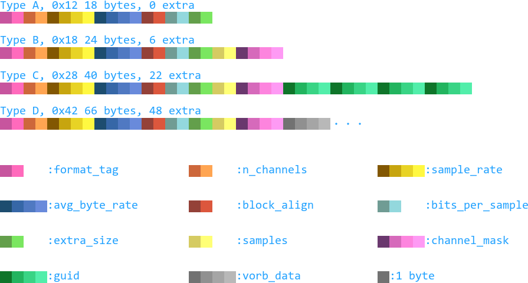

[Up](.)

# `fmt` Chunk
Microsoft WAVE files have a `fmt ` chunk, used to detail various aspects of the
audio data stored within.  

In [Ogg/Vorbis][vorbis spec], this information is stored differently, in the
[identification and setup headers][vorbis header spec] of the Vorbis stream.  

In Wwise RIFF/Vorbis, this information is stored differently again, some of it
in the `fmt ` chunk, and a majority of the Vorbis-specific data stored in
(sometimes mangled) versions of the standard Vorbis headers, elsewhere in the
stream.

In Wwise RIFF/Vorbis, the `fmt ` chunk is largely similar to the standard WAVE
version, however there is some customization. The details of the differences
are illustrated at [Wwise Format Modifications](#wwise-format-modifications).

## Table of Contents
1. [Standard `fmt ` Chunk Layouts](#standard-fmt--chunk-layouts)
2. [Wwise Format Modifications](#wwise-format-modifications)
3. [Format Tags](#format-tags)
4. [References](#references)

## Standard `fmt ` Chunk Structure
These structure layouts are taken from the [Windows 10 SDK][win10 sdk] file `mmreg.h`.

|Field                    |Bytes|Description                                                           |
|:---                     |:---:|:---                                                                  |
|`format_tag`             |2    |[Format tag](#format-tags).                                           |
|`n_channels`             |2    |Number of channels (i.e. mono, stereo, ...).                          |
|`sample_rate`            |4    |Samples of audio per second.                                          |
|`avg_byte_rate`          |4    |For buffer estimation (whatever that means).                          |
|`block_align`            |2    |Block size of data (audio blocksize?).                                |
|`bits_per_sample`        |2    |Bit-depth per PCM/mono audio sample.                                  |
|`extra_size`             |2    |Size of the extra format information immediately following this field.|
|`Samples`                |2    |A union of the following fields:                                      |
|`->valid_bits_per_sample`|_0_  |Bits of precision per audio sample.                                   |
|`->samples_per_block`    |_0_  |Valid of `bits_per_sample` is 0.                                      |
|`channel_mask`           |4    |Which channels are present in the stream.                             |
|`subformat`/`guid`       |16   |Extended sub-identifier for an extensible bitstream.                  |

## Wwise Format Modifications
These fields I took from reading the source code of [ww2ogg][ww2ogg gh] and
piecing things together from how they decoded the data.

Most fields are identical to their standard versions, except in `Type D`,
the `vorb_data` field. `vorb_data` is the data of a `Type A`
[`vorb`][vorbchunks] chunk stored in the extra data of the `fmt` chunk.

## Format Tags
The format type for a given WAVE file is stored in the `wFormatTag` field of
the `fmt ` structure.  
Notable format types:

|Name                     |Value   |Description                                                                                                          |
|:----                    |:---:   |:----                                                                                                                |
|`WAVE_FORMAT_EXTENSIBLE` |`0xFFFE`|Format used for an extended WAVE format not registered with Microsoft; the `GUID` field is the unique type identifier|
|`WAVE_FORMAT_DEVELOPMENT`|`0xFFFF`|Indicates the format is unofficial, or is in its development stages and to be registered with Microsoft              |

## References
* [ww2ogg Github][ww2ogg gh]
* [Windows 10 SDK][win10 sdk]

[win10 guid]:../misc/windefs.md#guid---shared-guiddef.h
[vorbchunks]:./vorb.md

[vorbis spec]:https://xiph.org/vorbis/doc/Vorbis_I_spec.html
[vorbis header spec]:https://xiph.org/vorbis/doc/Vorbis_I_spec.html#x1-590004
[ww2ogg gh]:https://github.com/hcs64/ww2ogg
[win10 sdk]:https://developer.microsoft.com/en-US/windows/downloads/windows-10-sdk/
[mgsv soundswap]:https://bobdoleowndu.github.io/mgsv/documentation/soundswapping.html
[wem format blueprints]:https://github.com/rickvg/Wwise-audiobanks-wem-format-blueprints/blob/master/WEM-File%20Template.bt
[topher lee pcm]:http://www.topherlee.com/software/pcm-tut-wavformat.html
[mcgill wave]:https://web.archive.org/web/20201228133457/http://www-mmsp.ece.mcgill.ca/documents/audioformats/wave/wave.html
[anders bergh old]:https://web.archive.org/web/20200621130653/https://bitbucket.org/anders/wwiseconv/wiki/WWise_format
[anders bergh new]:https://web.archive.org/web/20200621130652/https://bitbucket.org/anders/wwiseconv/wiki/New_WWise_format
