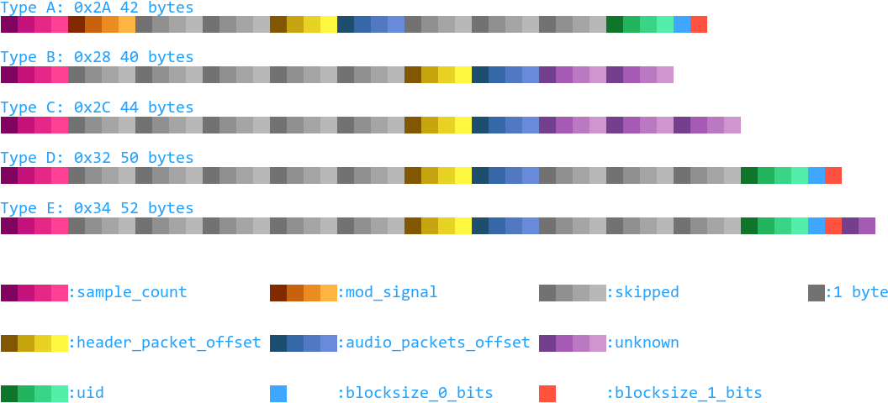

[Up](.)

# `vorb` Chunk
Wwise `WAVE/Vorbis` files store their vorbis data in a `vorb` chunk, which may
be a separate chunk or, depending on Wwise version, stored in the extra space
of the `fmt ` chunk.

## Table of Contents
1. [`vorb` Chunk Data Structure(s)](#vorb-chunk-data-structure)
0. [References](#references)

## `vorb` Chunk Data Structure(s)
These fields I took from reading the source code of [ww2ogg][ww2ogg gh] and
piecing things together from how they decoded the data.

## References
* [ww2ogg Github][ww2ogg gh]

[ww2ogg gh]:https://github.com/hcs64/ww2ogg
