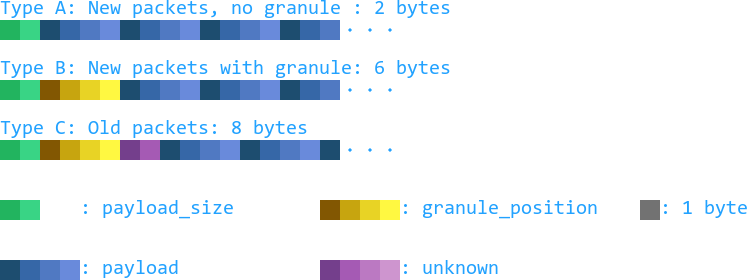

[Up](.)

The Wwise RIFF/Vorbis `data` chunk contains not just raw data, but data
packets. These packets have a very small header signifying minimal information
about the packet itself, whose layout is illustrated: 

|Field             |Bytes         |Description                            |
|:---              |:---          |:---                                   |
|`payload_size`    |2             |Size of the `payload`, in bytes.       |
|`granule_position`|4             |Unknown, seems to be mostly irrelevant.|
|`payload`         |`payload_size`|The payload of the packet.             |
|`unknown`         |-             |Unknown/unused bytes.                  |

Packet type varies slightly with Wwise version, which is detected by checking
the size of the [`vorb`][vorbchunk] chunk.  
What also varies with Wwise version is what [Vorbis headers][vorbis header doc] are present in the
stream, and in what capacity:
* If the `vorb` chunk is `Type B` or `Type C`:  
  * Vorbis header packets are present in full-spec and can be copied directly  
* Else  
  * Only the setup header is at all present, the others need to be built
    manually:  
    * The setup header may be stripped-down, in which case it needs to be rebuilt from what is
      present.  
        * Codebooks may be present in the header, or referenced externally:  
            * If they are internal, they must be rebuilt from what is present
              in the header.  
            * If they are external, they must be rebuilt from the referenced
              library.  
    * Otherwise, it can be copied (mostly\*) bit-for-bit.  
    \*Time-domain-transform information is completely missing from the header,
    and:  
        * Codebooks may be present in the header, or referenced externally:  
            * If they are internal, they can be copied bit-for-bit.  
            * If they are external, they must be rebuilt from the referenced
              library.  

The Vorbis header packets are individual Wwise-RIFF/Vorbis packets, and start
at `header_packet_offset`, specified in the `vorb` chunk, in the `data` chunk.

[vorbchunk]:./chunks/vorb.md
[vorbis header doc]:https://xiph.org/vorbis/doc/Vorbis_I_spec.html#x1-590004
